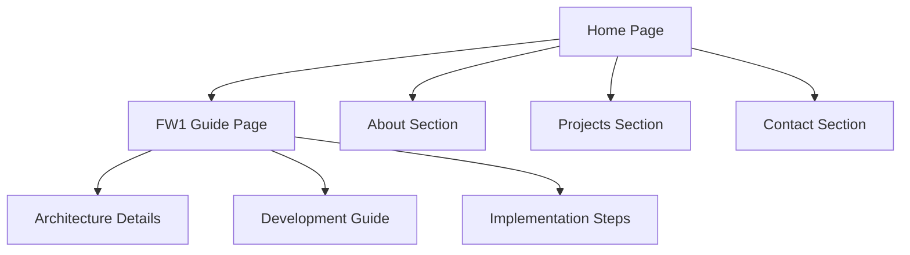

## 1. Product Overview
Papanative is a modern static website showcasing a headless network appliance built with Rust and eBPF. The site features an engineer's professional profile and a comprehensive technical guide for building enterprise-grade firewall appliances.

The product demonstrates how to build secure, high-performance network infrastructure using Rust's memory safety and eBPF's kernel-level packet processing capabilities.

## 2. Core Features

### 2.1 User Roles
No user roles required - this is a static informational site.

### 2.2 Feature Module
Our site requirements consist of the following main pages:
1. **Home page**: engineer profile, professional background, project showcase.
2. **FW1 Guide page**: comprehensive technical documentation for building the network appliance.

### 2.3 Page Details
| Page Name | Module Name | Feature description |
|-----------|-------------|---------------------|
| Home page | Hero section | Display engineer's name, title, and professional tagline with modern typography and subtle animations. |
| Home page | About section | Present professional background, skills, and experience in network engineering and Rust development. |
| Home page | Projects showcase | Highlight key projects including the Papanative firewall appliance with technical details. |
| Home page | Contact section | Provide professional contact information and links to GitHub/LinkedIn profiles. |
| FW1 Guide page | Product overview | Explain the headless network appliance concept and its core capabilities. |
| FW1 Guide page | Architecture diagram | Visual representation of the Rust control plane and eBPF data plane architecture. |
| FW1 Guide page | Development phases | Step-by-step guide covering the 4-phase development approach. |
| FW1 Guide page | Technical stack | Detailed breakdown of technologies: Buildroot, Rust, eBPF, WireGuard. |
| FW1 Guide page | Implementation guide | Practical instructions for building and deploying the appliance. |

## 3. Core Process
Users navigate through a single-page experience with smooth scrolling between sections. The FW1 Guide page provides comprehensive technical documentation that engineers can follow to build their own network appliances.

## 4. User Interface Design

### 4.1 Design Style
- **Primary colors**: Deep charcoal (#1a1a1a), electric blue (#0066ff), white (#ffffff)
- **Secondary colors**: Light gray (#f5f5f5), accent orange (#ff6b35)
- **Button style**: Rounded corners with subtle hover animations and gradient effects
- **Typography**: Inter for body text, JetBrains Mono for code snippets
- **Layout style**: Card-based design with generous whitespace and grid layouts
- **Icons**: Modern line icons from Lucide React or Heroicons

### 4.2 Page Design Overview
| Page Name | Module Name | UI Elements |
|-----------|-------------|-------------|
| Home page | Hero section | Full-width dark background with animated gradient overlay, large typography for name/title, subtle parallax effect on scroll. |
| Home page | About section | Two-column layout with profile image and text, skill tags with hover effects, timeline visualization for experience. |
| Home page | Projects | Grid layout with project cards featuring hover animations, tech stack badges, and GitHub links. |
| FW1 Guide | Architecture | Interactive SVG diagram with clickable components, syntax-highlighted code blocks, collapsible sections. |

### 4.3 Responsiveness
Desktop-first design approach with mobile optimization. Breakpoints at 768px and 1024px. Touch-friendly navigation and optimized typography scaling for mobile devices.

### 4.4 3D Scene Guidance
Not applicable - this is a static informational website focused on technical content