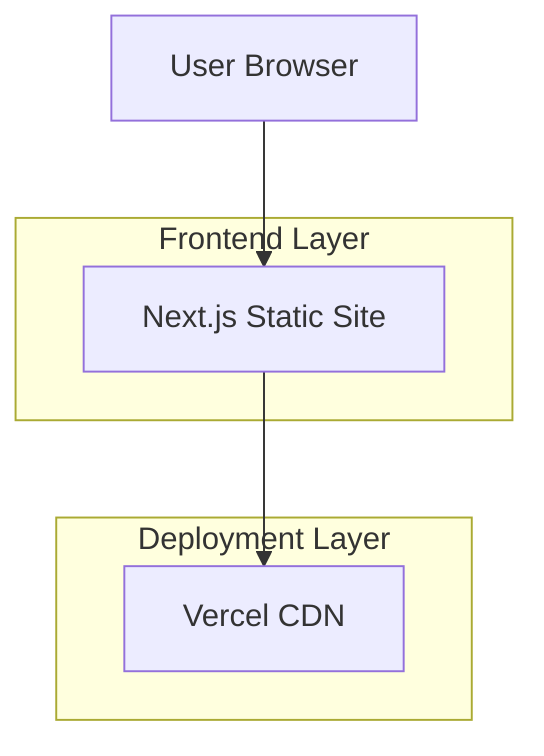

## 1. Architecture Design



## 2. Technology Description
- **Frontend**: Next.js@14 + React@18 + TypeScript@5
- **Initialization Tool**: create-next-app
- **Styling**: Tailwind CSS@3 + Framer Motion
- **Icons**: Lucide React
- **Code Highlighting**: Prism.js or Shiki
- **Deployment**: Vercel (static export)
- **Backend**: None (static site)

## 3. Route Definitions
| Route | Purpose |
|-------|---------|
| / | Home page with engineer profile and project showcase |
| /fw1 | Comprehensive technical guide for building the network appliance |

## 4. API Definitions
No backend APIs required - this is a static informational site.

## 5. Server Architecture Diagram
Not applicable - static site deployment via CDN.

## 6. Data Model
No database required - all content is static and hardcoded in the application.

### 6.1 Static Content Structure
```typescript
interface EngineerProfile {
  name: string;
  title: string;
  tagline: string;
  bio: string;
  skills: string[];
  projects: Project[];
  contact: ContactInfo;
}

interface Project {
  id: string;
  name: string;
  description: string;
  technologies: string[];
  githubUrl?: string;
  demoUrl?: string;
}

interface ContactInfo {
  email: string;
  github: string;
  linkedin: string;
  location: string;
}
```

### 6.2 FW1 Guide Content Structure
```typescript
interface FW1Guide {
  overview: string;
  architecture: ArchitectureDiagram;
  developmentPhases: DevelopmentPhase[];
  techStack: TechStack;
  implementation: ImplementationStep[];
}

interface DevelopmentPhase {
  id: string;
  title: string;
  duration: string;
  goals: string[];
  tasks: string[];
}
```

## 7. Build Configuration
- **Static Export**: `next export` for optimal performance
- **Image Optimization**: Next.js Image component with static generation
- **Bundle Analysis**: Webpack Bundle Analyzer for size optimization
- **Performance**: Core Web Vitals optimization, 100/100 Lighthouse